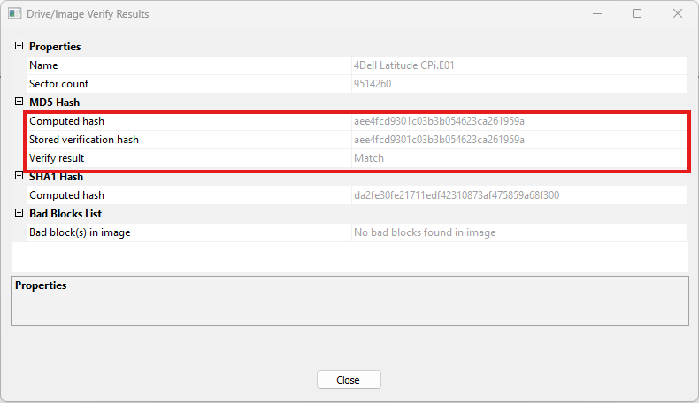
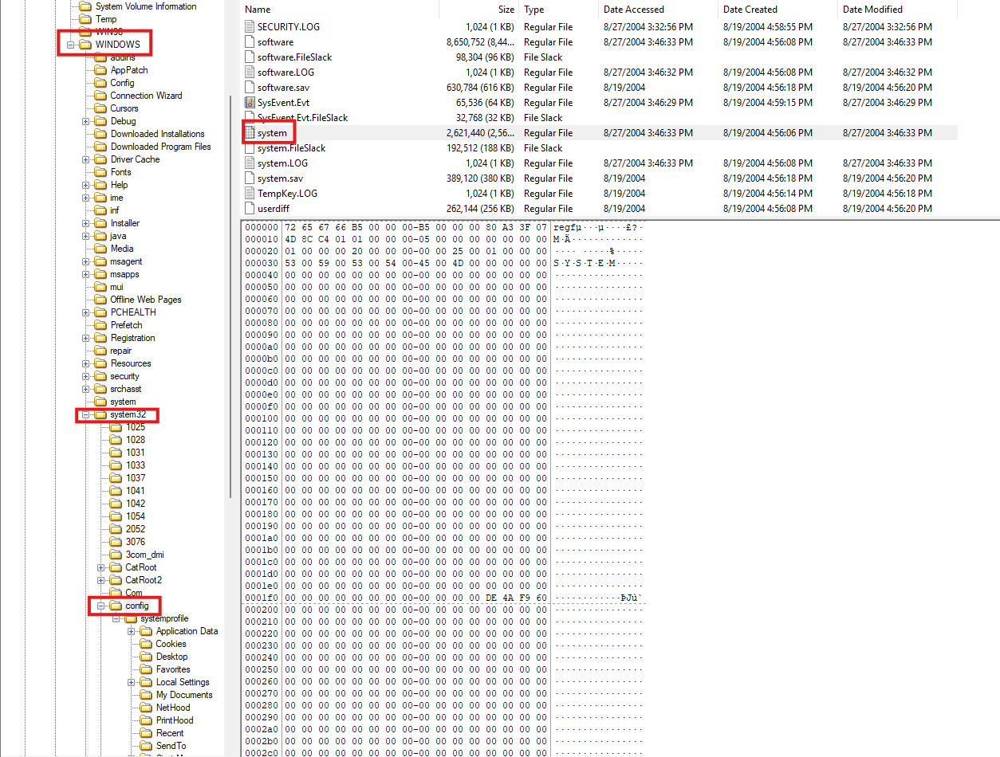
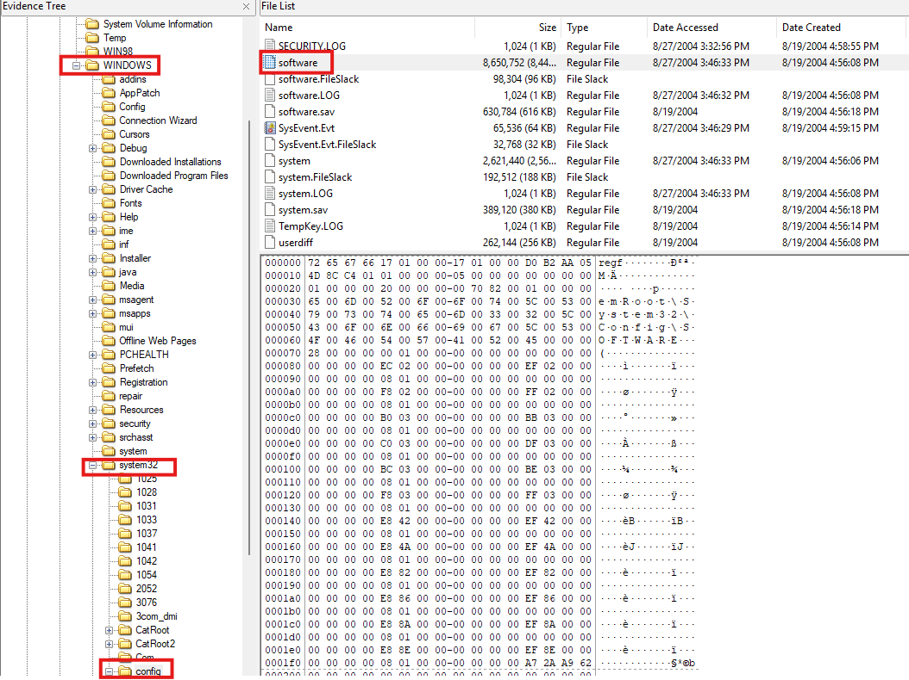
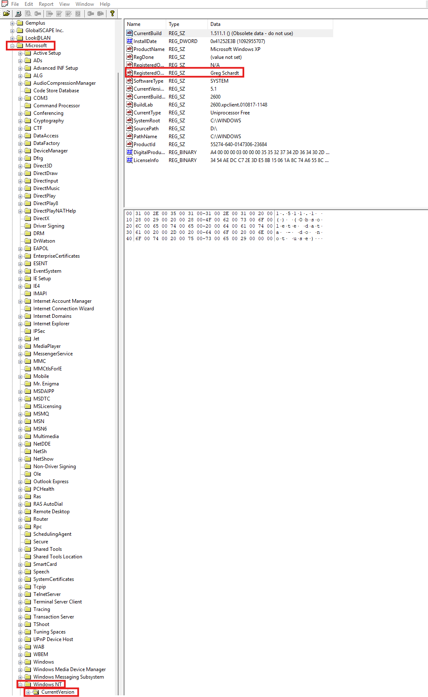
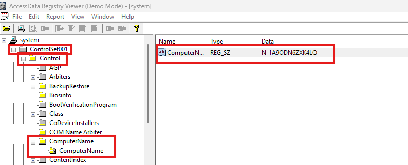
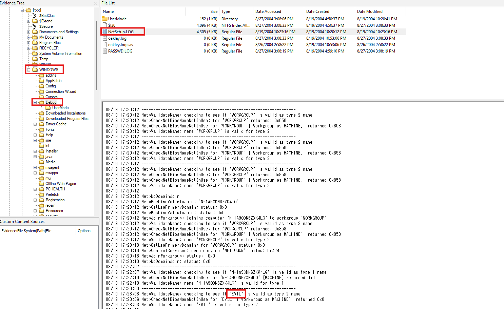
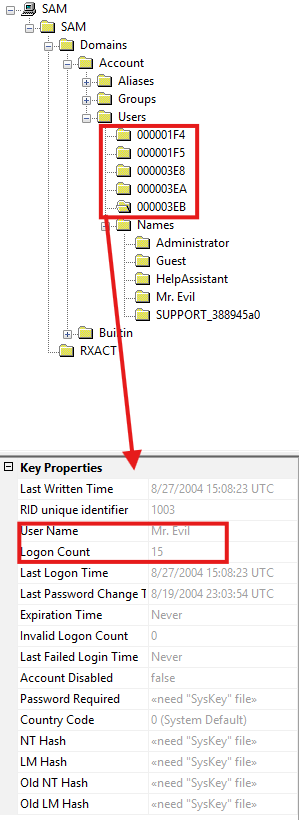

# Cfreds-Hacking-Case
Documention of my solution(s) for the Cfreds "Hacking Case" digital forensics scenario which can be found here: https://cfreds-archive.nist.gov/Hacking_Case.html

The forensics software I'm using is the free version of Exterro's FTK Imager  
  

## Scenario:

On 09/20/04 , a Dell CPi notebook computer, serial # VLQLW, was found abandoned along with a wireless PCMCIA card and an external homemade 802.11b antennae. It is suspected that this computer was used for hacking purposes, although cannot be tied to a hacking suspect, G=r=e=g S=c=h=a=r=d=t. (The equal signs are just to prevent web crawlers from indexing this name; there are no equal signs in the image files.)  Schardt also goes by the online nickname of “Mr. Evil” and some of his associates have said that he would park his vehicle within range of Wireless Access Points (like Starbucks and other T-Mobile Hotspots) where he would then intercept internet traffic, attempting to get credit card numbers, usernames & passwords.

Find any hacking software, evidence of their use, and any data that might have been generated. Attempt to tie the computer to the suspect, G=r=e=g S=c=h=a=r=d=t.

This scenario comes with 30 questions to be answered, and the images you'll want to use are the EnCase images (note that only the first one opened in FTK imager for me, and only after downloading both).

## 1. What is the image hash? Does the acquisition and verification hash match?

To solve this, we use FTK imager's built-in verification function found on the top toolbar.  
  
This will open a dialog box/window that will run for a few seconds (9 in my case) and then will leave you with a window containing the hashes.  
  
As we can see, the answer to the first question is **aee4fcd9301c03b3b054623ca261959a** and the verification hash does indeed match.  

## 2. What operating system was used on the computer?

To find this, we must navigate through the file system of the machine image to the **[root]** folder where we will find a file called **boot.ini**, this file will contain the operating system used on the machin in plaintext once selected.  
  
As we can see, the answer in this case is **Microsoft Windows XP Professional**  

## 3. When was the install date?

To find this, we can simply look at the creation date of the **boot.ini** file from the last question, which reveals the answer to be **08/19/2004 4:47:33 PM**  
  

##  4. What is the timezone settings?

For this, we need to navigate to **Windows/system32/config** and EXPORT the file called **system** (by right-clicking and selecting the export option) since this contains the information we need. then we need to open it in **registry viewer**, which is a tool that can be found here: https://www.exterro.com/ftk-downloads/registry-viewer-2-0-0  
  
Doing so will allow us to navigate to **the active control set** (in this case ControlSet001) then to **Control** and finally to **TimeZoneInformation** where we can find the answer to be **Central Standard/Daylight Time** 
  

## 5. Who is the registered owner?

Like the previous question, we will need to export a file and open it in Registry Viewer, but this time the file we need is **software**, and it's located in the same place as **system**  
  
Once open in Registry Viewer, we can navigate to **Microsoft/WindowsNT/CurrentVersion** where the registered owner is visible in plaintext which says **Greg Schardt**  
  

##  6. What is the computer account name?

This can be found in the **system** file we already exported and opened under the **current control set** (in this case ControlSet001) under control and in the **ComputerName** entry which gives us an answer of **N-1A9ODN6ZXK4LQ**  
  

##  7. What is the primary domain name?

This one was a bit tricky as under the usual **services/tcpip/parameters** tab in **system** the **Domain** string is empty, the closest thing I could find was the name **EVIL** in **NetSetup.LOG** in **Windows/system32/debug**  
  

##  8. When was the last recorded computer shutdown date/time?

For this one, we need to remain in the **system** registry hive, and we need to navigate to **ControlSet001/Control/Windows** where we can find the **ShutdownTime** entry, which contains the value **C4 FC 00 07 4D 8C C4 01** which is stored in the **64-bit FILETIME format**. While it is possible to convert this to a regular date and time, this should be sufficient for the purposes of this scenario.  
  

##  9. How many accounts are recorded (total number)?

For this, we need to export the **SAM** registry hive, which is in the same place as the previous two that we have already exported. From there we need to navigate to **SAM/Domains/Account/Users/Names** where we can count a total of **5** accounts: **Administrator, Guest, HelpAssistant, Mr.Evil,** and **SUPPORT_388945a0**  
  

##  10. What is the account name of the user who mostly uses the computer?

By looking through the **SAM** registry hive we can find that **Mr.Evil** logged on to the computer **15 times**  
  

##  11. Who was the last user to logon to the computer?

By exploring the **software** registry hive to **Microsoft/WindowsNT/CurrentVersion/Winlogon** we can see that the default username is **Mr.Evil**, since this is the value in there, it can be safely assumed that he last used the computer since the default username is the username of the last person to log in on that particular machine. 
  
