# Cfreds-Hacking-Case
Documention of my solution(s) for the Cfreds "Hacking Case" digital forensics scenario which can be found here: https://cfreds-archive.nist.gov/Hacking_Case.html

The forensics software I'm using is the free version of Exterro's FTK Imager  
  

## Scenario:

On 09/20/04 , a Dell CPi notebook computer, serial # VLQLW, was found abandoned along with a wireless PCMCIA card and an external homemade 802.11b antennae. It is suspected that this computer was used for hacking purposes, although cannot be tied to a hacking suspect, G=r=e=g S=c=h=a=r=d=t. (The equal signs are just to prevent web crawlers from indexing this name; there are no equal signs in the image files.)  Schardt also goes by the online nickname of “Mr. Evil” and some of his associates have said that he would park his vehicle within range of Wireless Access Points (like Starbucks and other T-Mobile Hotspots) where he would then intercept internet traffic, attempting to get credit card numbers, usernames & passwords.

Find any hacking software, evidence of their use, and any data that might have been generated. Attempt to tie the computer to the suspect, G=r=e=g S=c=h=a=r=d=t.

**This scenario comes with 31 questions to be answered, and the images you'll want to use are the EnCase images (note that only the first one opened in FTK imager for me, and only after downloading both).**

## 1. What is the image hash? Does the acquisition and verification hash match?

To solve this, we use FTK imager's built-in verification function found on the top toolbar.  
  
This will open a dialog box/window that will run for a few seconds (9 in my case) and then will leave you with a window containing the hashes.  
  
As we can see, the answer to the first question is **aee4fcd9301c03b3b054623ca261959a** and the verification hash does indeed match.  

## 2. What operating system was used on the computer?

To find this, we must navigate through the file system of the machine image to the **[root]** folder, where we will find a file called **boot.ini**. This file will contain the operating system used on the machine in plaintext once selected.  
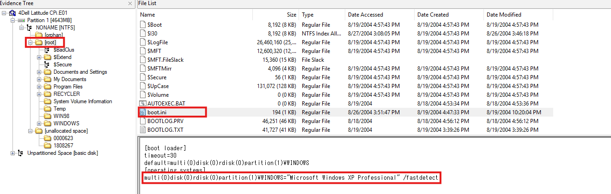  
As we can see, the answer in this case is **Microsoft Windows XP Professional**  

## 3. When was the install date?

To find this, we can simply look at the creation date of the **boot.ini** file from the last question, which reveals the answer to be **08/19/2004 4:47:33 PM**  
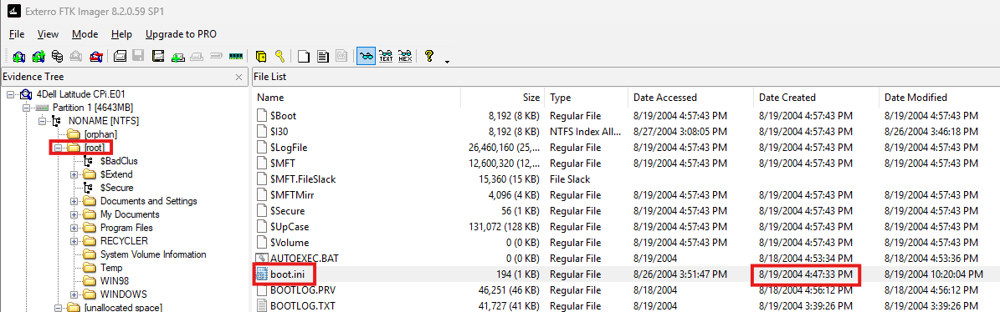  

## 4. What is the timezone settings?

For this, we need to navigate to **Windows/system32/config** and EXPORT the file called **system** (by right-clicking and selecting the export option) since this contains the information we need. then we need to open it in **registry viewer**, which is a tool that can be found here: https://www.exterro.com/ftk-downloads/registry-viewer-2-0-0  
  
Doing so will allow us to navigate to **the active control set** (in this case ControlSet001) then to **Control** and finally to **TimeZoneInformation** where we can find the answer to be **Central Standard/Daylight Time** 
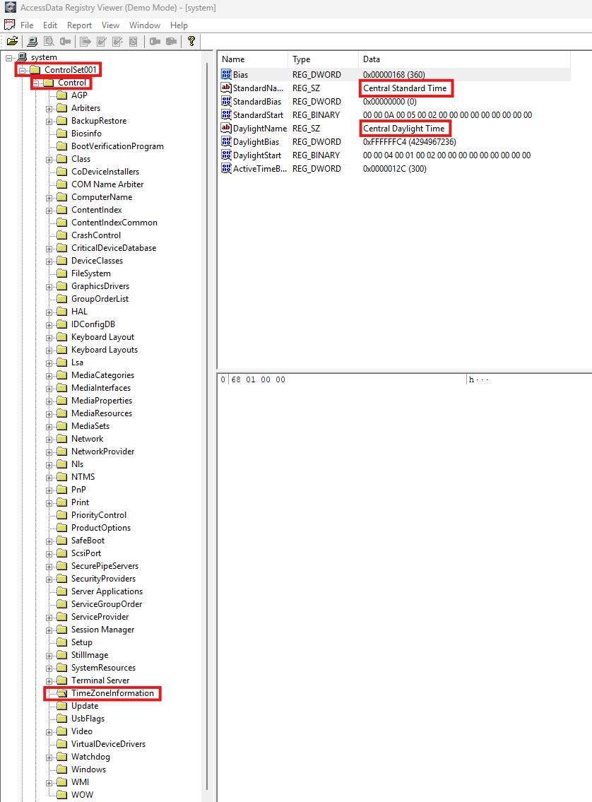  

## 5. Who is the registered owner?

Like the previous question, we will need to export a file and open it in Registry Viewer, but this time the file we need is **software**, and it's located in the same place as **system**  
  
Once open in Registry Viewer, we can navigate to **Microsoft/WindowsNT/CurrentVersion** where the registered owner is visible in plaintext which says **Greg Schardt**  
  

## 6. What is the computer account name?

This can be found in the **system** file we already exported and opened under the **current control set** (in this case ControlSet001) under control and in the **ComputerName** entry which gives us an answer of **N-1A9ODN6ZXK4LQ**  
  

## 7. What is the primary domain name?

This one was a bit tricky as under the usual **services/tcpip/parameters** tab in **system** the **Domain** string is empty, the closest thing I could find was the name **EVIL** in **NetSetup.LOG** in **Windows/system32/debug**  
  

## 8. When was the last recorded computer shutdown date/time?

For this one, we need to remain in the **system** registry hive, and we need to navigate to **ControlSet001/Control/Windows** where we can find the **ShutdownTime** entry, which contains the value **C4 FC 00 07 4D 8C C4 01** which is stored in the **64-bit FILETIME format**. While it is possible to convert this to a regular date and time, this should be sufficient for the purposes of this scenario.  
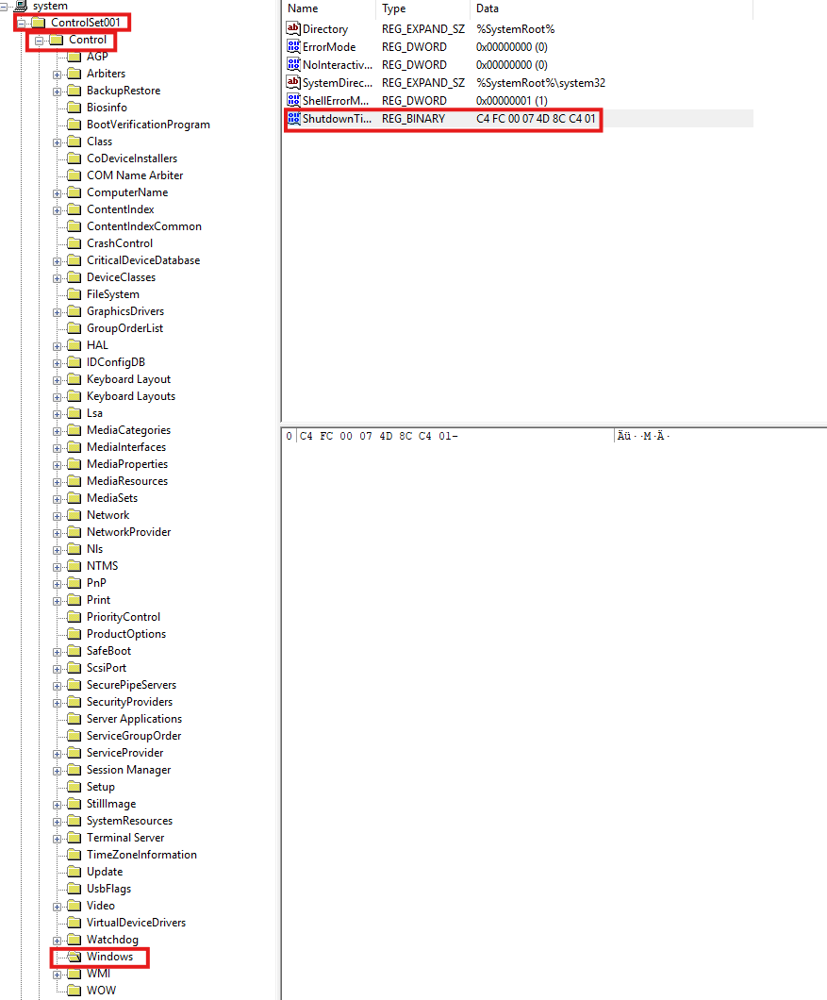  

## 9. How many accounts are recorded (total number)?

For this, we need to export the **SAM** registry hive, which is in the same place as the previous two that we have already exported. From there we need to navigate to **SAM/Domains/Account/Users/Names** where we can count a total of **5** accounts: **Administrator, Guest, HelpAssistant, Mr.Evil,** and **SUPPORT_388945a0**  
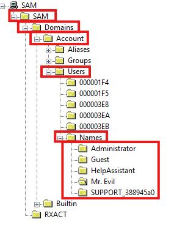  

## 10. What is the account name of the user who mostly uses the computer?

By looking through the **SAM** registry hive we can find that **Mr.Evil** logged on to the computer **15 times**  
  

## 11. Who was the last user to logon to the computer?

By exploring the **software** registry hive to **Microsoft/WindowsNT/CurrentVersion/Winlogon** we can see that the default username is **Mr.Evil**, since this is the value in there, it can be safely assumed that he last used the computer since the default username is the username of the last person to log in on that particular machine. 
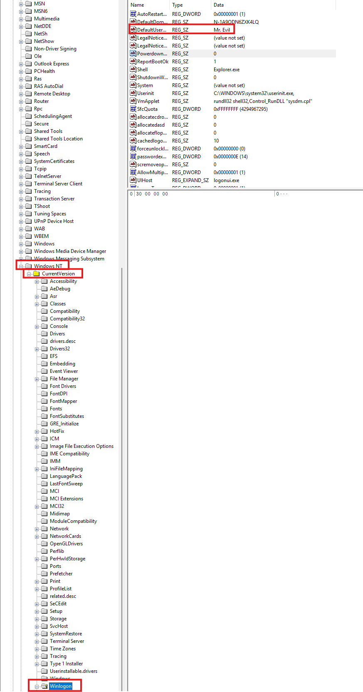  

## 12. A search for the name of “G=r=e=g S=c=h=a=r=d=t” reveals multiple hits. One of these proves that G=r=e=g S=c=h=a=r=d=t is Mr. Evil and is also the administrator of this computer. What file is it? What software program does this file relate to?

To figure this out, we must look through the program files to find the program where both Mr. Evil and Greg Schardt are listed. I chose to look through the files of programs that aren't native to Windows since they're most likely to have been downloaded by our guy. After looking through some of the text files (.ini, .txt), I found the file **irunin.ini** under the **Look@LAN** entry of program files. In this file we see that Mr. Evil is the LAN User and Greg Schardt is the Registry Owner which proves that Greg and Mr. Evil are the same. 
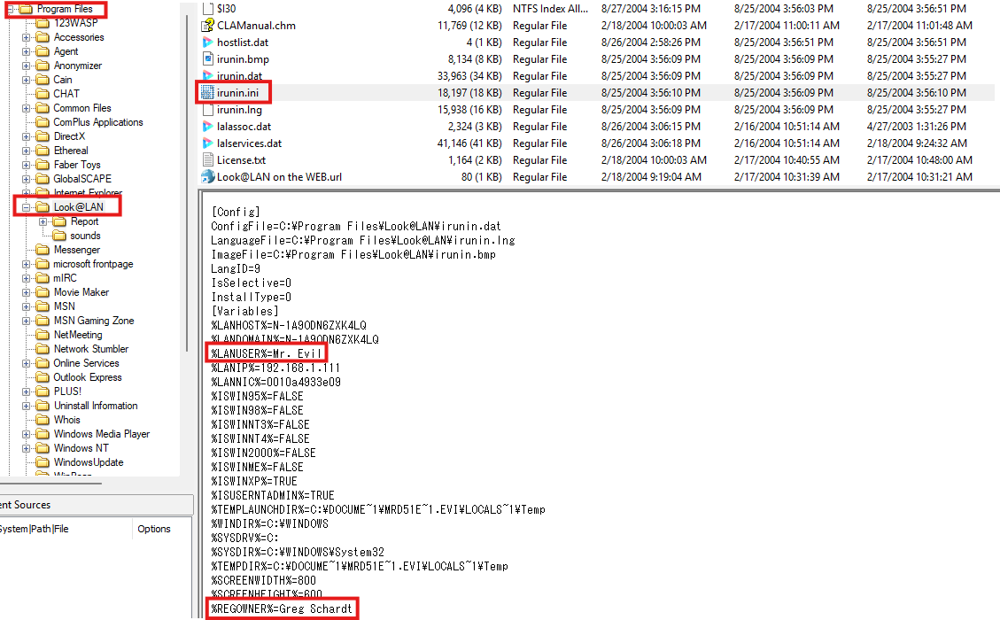  

## 13.  List the network cards used by this computer

For this, we must go back to the software registry hive to **WindowsNT/CurrentVersion/NetworkCards** where we will find two folders. Within these two folders are the names of the two network cards in this machine, them being **Compaq WL110 Wireless LAN PC Card** and **Xircom CardBus Ethernet 100 + Modem 56 (Ethernet Interface)** 
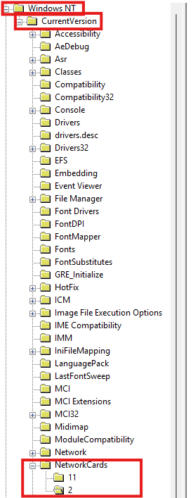  
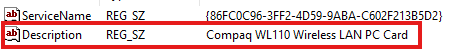  
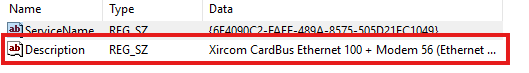  

## 14. This same file reports the IP address and MAC address of the computer. What are they?

Looking back in the **irunin.ini** file, we see entries for **LANIP and LANNIC** which are **192.168.1.111 and 0010a4933e09** 
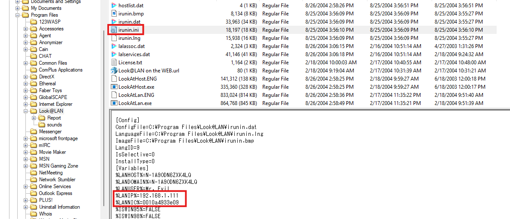  

## 15. An internet search for vendor name/model of NIC cards by MAC address can be used to find out which network interface was used. In the above answer, the first 3 hex characters of the MAC address report the vendor of the card. Which NIC card was used during the installation and set-up for LOOK@LAN?

Now that we have the MAC address from **irunin.ini** we can use a free online lookup tool to pinpoint the vendor of the card used for setting up Look@LAN which, in this case, is the **Xircom** card we discovered earlier. 
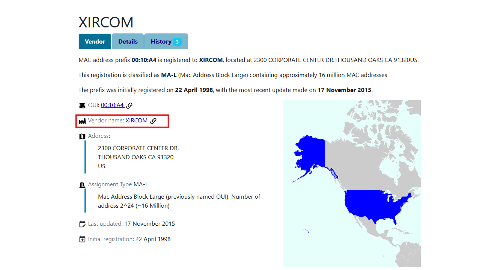  

## 16. Find 6 installed programs that may be used for hacking.

This really is just as simple as looking through Program Files and looking up any names that seem suspicious.  

| Program Name | Purpose |
| :---: | :---: |
| 123WASP | Password storer/decrypter |
| Look@LAN | Monitor connections to a network |
| Anonymizer | Proxy creation tool |
| Cain & Abel | Password cracker |
| Ethereal | Packet sniffer |
| Net Stumbler | Network mapping tool |

  
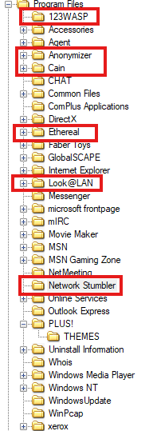  

## 17. What is the SMTP email address for Mr. Evil?

To find this, we must look through the filesystem for the place where a majority of user data is stored or the **NTUSER.DAT** file. After exporting this file, we can open it in a text editor (like Notepad) and do a search for SMTP, which yields the result **whoknowsme@sbcglobal.net**; however, the file is otherwise full of gibberish. A more readable view can be achieved by using Registry Viewer to open the file.  
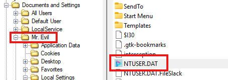  

## 18. What are the NNTP (news server) settings for Mr. Evil?

Like the previous question, the answers are located in the **NTUSER.DAT** file where a keyword search for NNTP returns some data but opening it in Registry Viewer reveals it in a much more readable format. From this, we get the server **news.dallas.sbcglobal.net** the user **whoknowsme@sbcglobal.net** the password **news.dallas.sbcglobal.netF6E2BA30** the display name **Mr. Evil** and the NNTP email **whoknowsme@sbcglobal.net** 
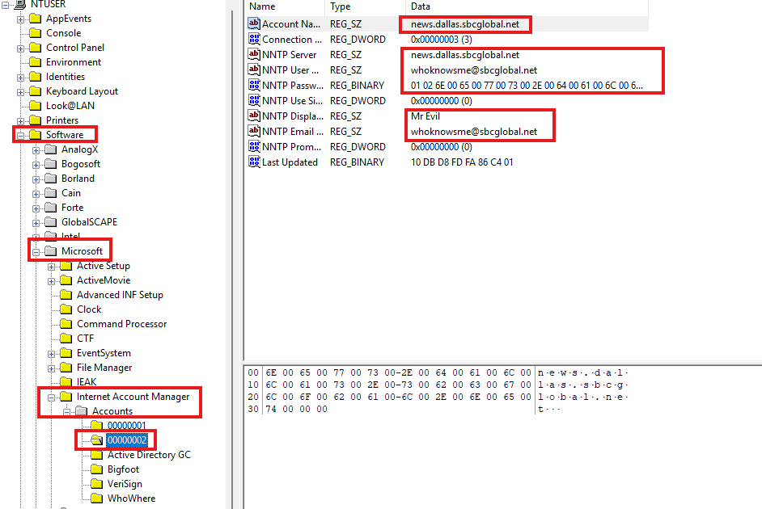  

## 19. What two installed programs show this information?

Just by viewing the location of the data we previously extracted, that being in NTUSER.DAT under the  **Internet Accounts Manager/Accounts** folder(s), we can conclude that **Outlook Express** is one of the programs because Internet Accounts Manager is the built-in location for Outlook Express to store this data, therefore finding it there means that Outlook Express nust have been used on this machine. In order to find the other program, we need to go back to the evidence tree of the image and start searching. While I was looking into the software installed on this PC, I found out that Forte Agent is a newsreader that gives me a place to look concerning the NNTP data. Upon navigating to the **Data** folder and looking through **agent.ini**, I found that all the settings and credentials matched what was found in the NTUSER.DAT registry hive, confirming that **Forte Agent** is the other program.  
  
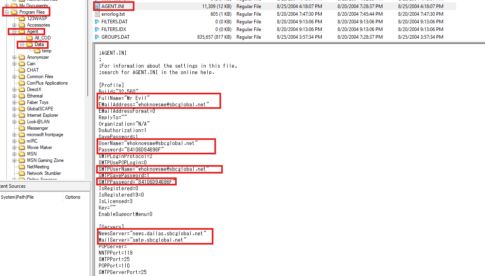  

## 20. List 5 newsgroups that Mr. Evil has subscribed to?

This data is stored under Mr. Evil's local settings in the **Identities** folder we can find **alt.binaries.hacking.dbx, alt.binaries.hacking.beginner.dbx, alt.binaries.hacking.computers.dbx, free.binaries.hacking.malicious.dbx, and free.binaries.hacking.websites.dbx**  
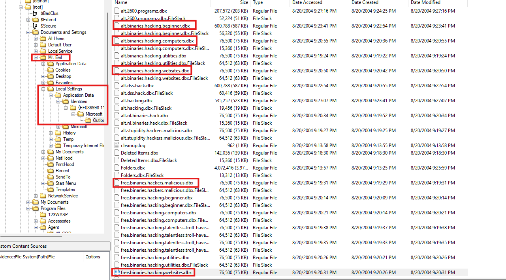  

## 21. A popular IRC (Internet Relay Chat) program called MIRC was installed.  What are the user settings that was shown when the user was online and in a chat channel?

This information is conveniently located in the mIRC program files entry in the **mirc.ini** file.  
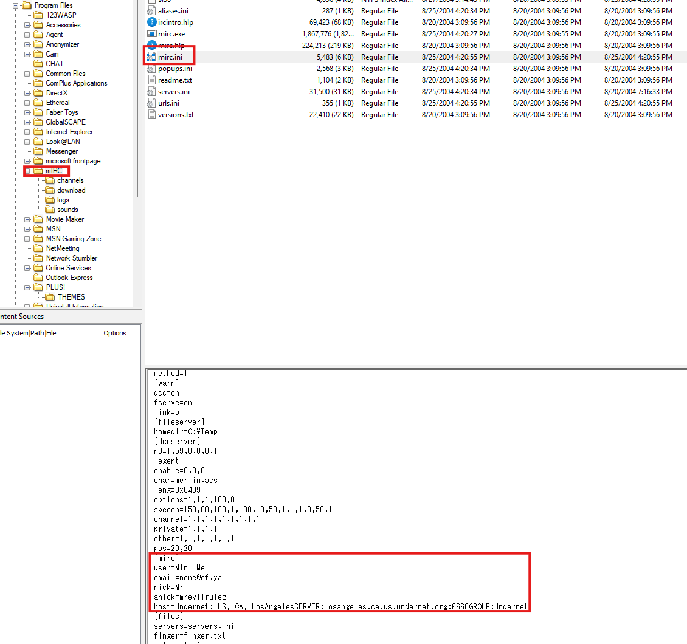  

## 22. This IRC program has the capability to log chat sessions. List 3 IRC channels that the user of this computer accessed.

In the **logs** folder we can find all of the sessions this user connected to. 3 of them are: **CyberCafe.UnderNet, Elite.Hackers.UnderNet, and thedarktower.AfterNET**  
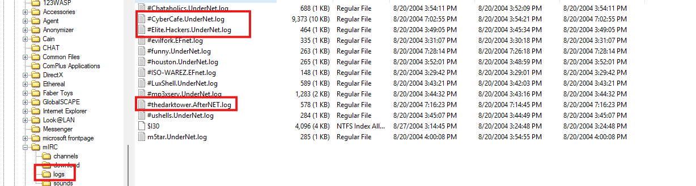  

## 23. Ethereal, a popular “sniffing” program that can be used to intercept wired and wireless internet packets was also found to be installed. When TCP packets are collected and re-assembled, the default save directory is that users \My Documents directory. What is the name of the file that contains the intercepted data?  

By looking in the **recent** file in the **application data** folder, we can find that the name of the file is **interception**  
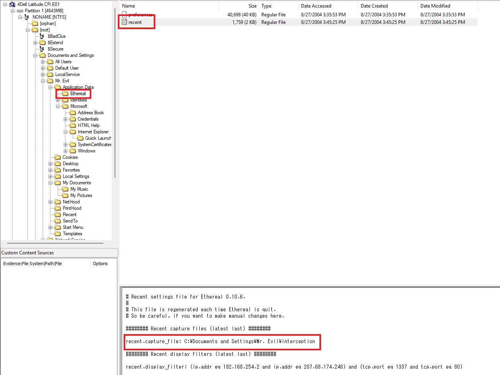  

## 24. Viewing the file in a text format reveals much information about who and what was intercepted. What type of wireless computer was the victim (person who had his internet surfing recorded) using?

The type of wireless computer used by the victim is **Windows CE (Pocket PC) - Version 4.20**  
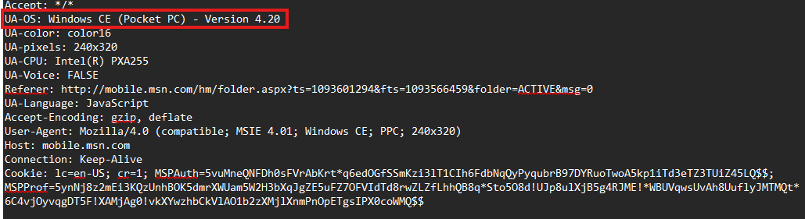  

## 25. What websites was the victim accessing?

The victim accessed **msn.com, passportimages.com, login.passport.com, and login.passport.net**  
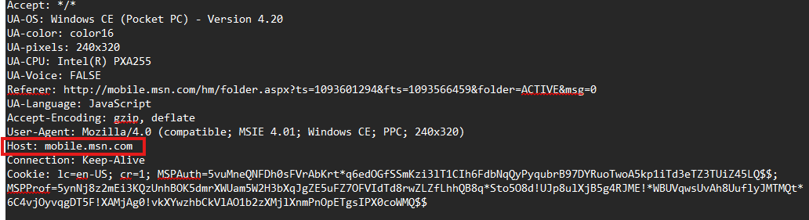  
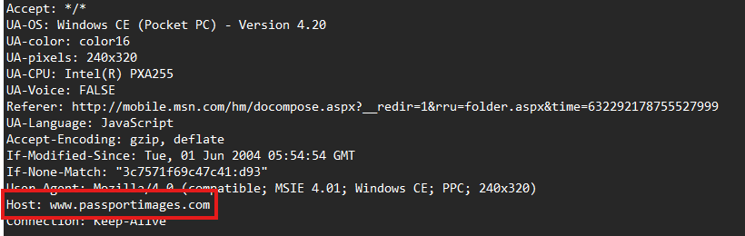  
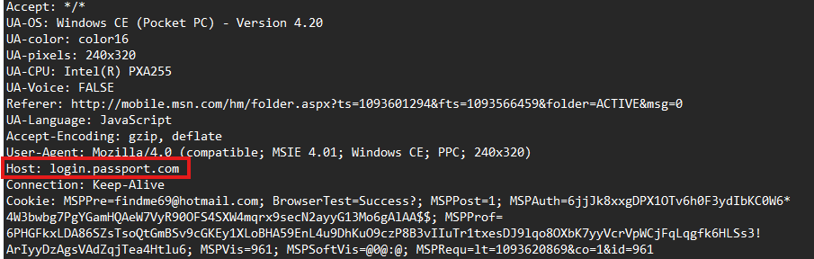  
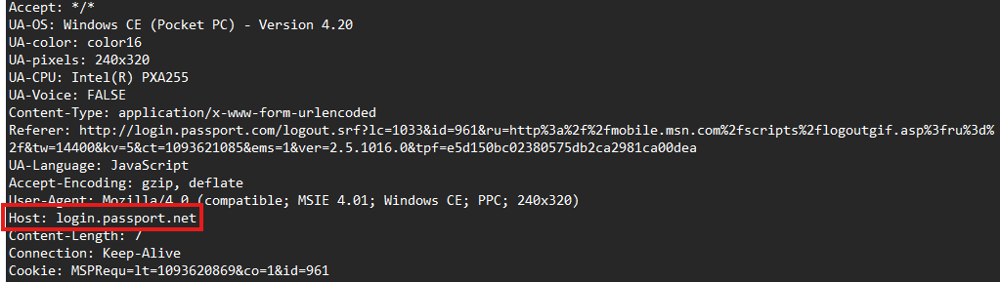  

## 26. Search for the main users web based email address. What is it?

This information can be found by looking in **Mr. Evil/Local Settings/Temporary Internet Files/Content.IE5/HYU1BON0** in the **ShowLetter[1].htm** file and reveals the answer to be **mrevilrulez@yahoo.com**  
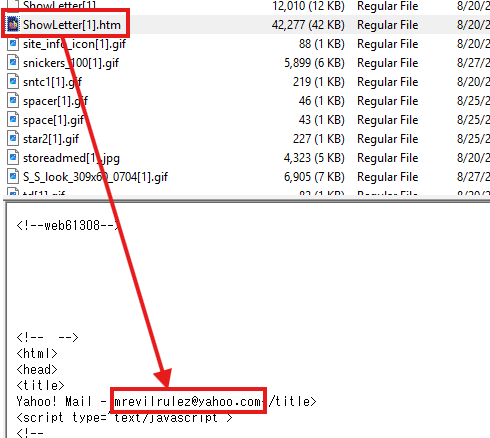  

## 27. Yahoo mail, a popular web based email service, saves copies of the email under what file name?

This is answered by the same folder as the last question as it contains both the email address and the messages in the inbox and other folders.  
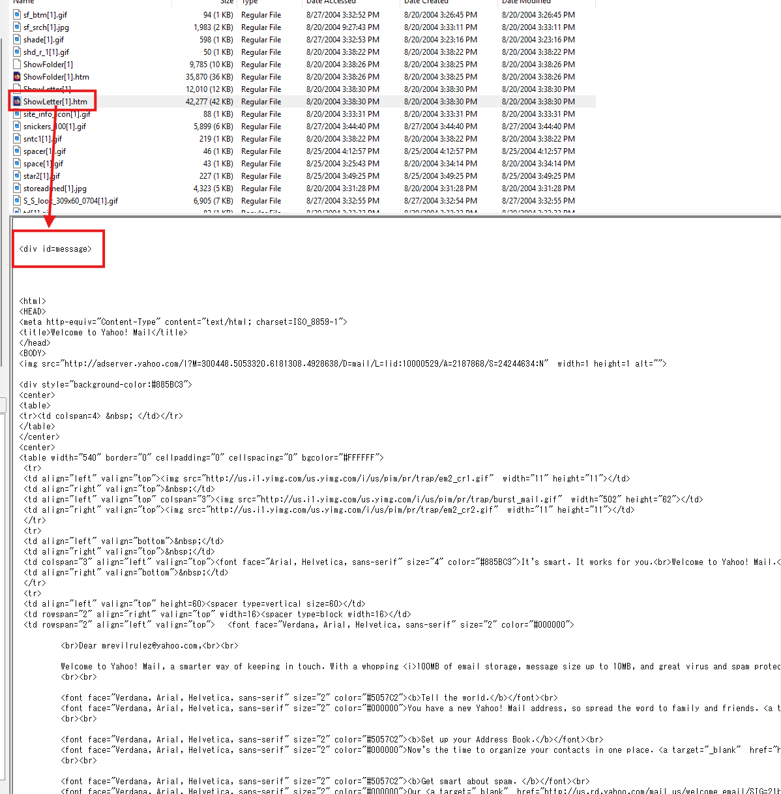  

## 28. How many executable files are in the recycle bin?

By navigating to **RECYCLER/S-1-5-21-2000478354-688789844-1708537768-1003** we can count a total of **4** executables in the recycle bin.  
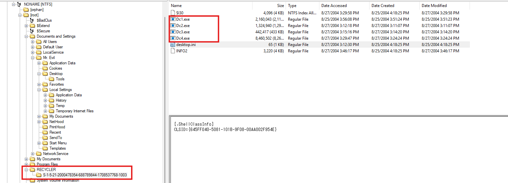  

## 29. Are these files really deleted?

No, since they are still in the recycle bin they can be restored via the Windows GUI, by right-clicking on any file in the recycle bin we can select restore to put it back where it was.  

## 30. How many files are actually reported to be deleted by the file system?

For the sake of saving time, here I used Autopsy (found here: https://www.autopsy.com/download/) to get the number of deleted files instantly, the answer is **365**
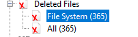  

## 31. Perform an Anti-Virus check. Are there any viruses on the computer?

After mounting the drive with FTK Imager's built-in mounting tool and scanning it with Malwarebytes (free version) there were 15 hits on the filesystem, so yes, there are viruses on the computer.
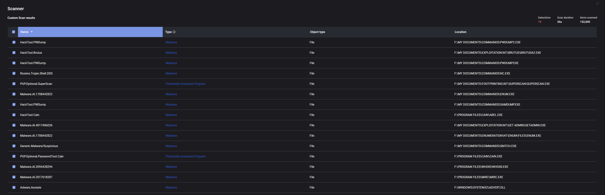  
